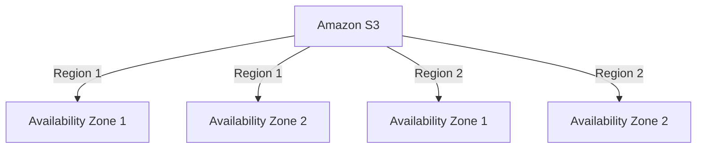
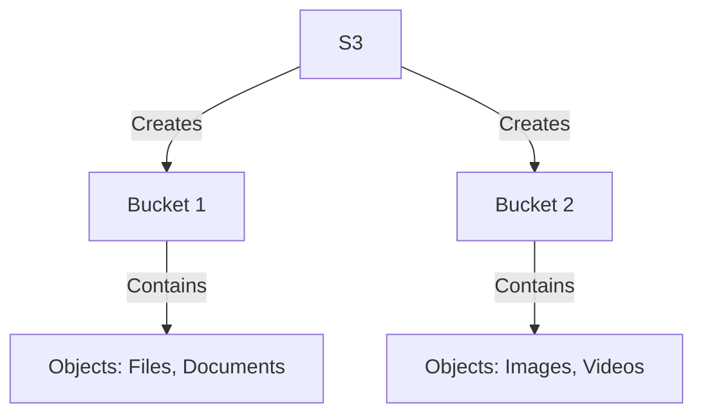
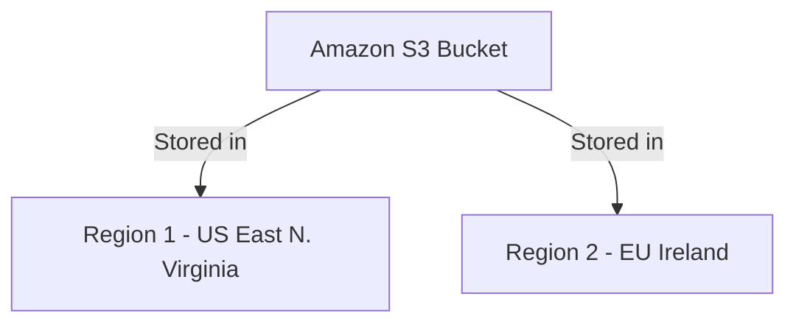

# 📌 Introduction to Amazon S3  

## 🔹 What is Amazon S3?  
Amazon S3 (Simple Storage Service) is an **object storage service** provided by AWS that offers **scalability, security, and high durability** for storing and retrieving data from anywhere on the internet.  

## 🔹 Benefits of Amazon S3  
✅ **Highly Scalable** – Stores unlimited data and scales automatically.  
✅ **Durable & Reliable** – 99.999999999% (11 nines) durability.  
✅ **Secure** – Supports encryption, access control, and policies.  
✅ **Cost-Effective** – Pay only for the storage and requests used.  
✅ **Easy Integration** – Works with AWS services like EC2, Lambda, and CloudFront.  

## 🔹 AWS S3 Global Infrastructure  
Amazon S3 operates across multiple **Regions and Availability Zones (AZs)** for high availability.  

---
## 🔹 Key Concepts in Amazon S3  

### 1️⃣ **Buckets**  
A bucket is a **container for storing objects**. Each bucket is globally unique and tied to a specific region.  

### 2️⃣ **Objects**  
Objects are the **actual data stored** in S3, such as files, images, videos, and logs. Each object consists of:  
- Data (the file itself)  
- Metadata (info about the object)  
- A unique **key (filename)**  

### 3️⃣ **Regions & Availability Zones**  
- Amazon S3 lets you **choose a region** closest to your users for low latency.  
- Objects are stored across multiple **Availability Zones (AZs)** for durability.  

---

## 🔹 Hands-on: Creating an S3 Bucket  
Follow these steps to create an S3 bucket:  

1️⃣ **Login to AWS Console**  
2️⃣ **Go to S3 Service**  
3️⃣ **Click "Create Bucket"**  
4️⃣ **Enter a Unique Bucket Name**  
5️⃣ **Select a Region** (e.g., `us-east-1`)  
6️⃣ **Enable or Disable Public Access**  
7️⃣ **Click "Create"**  

📌 **Author:** Satyam Singh  
🔗 **Follow for More AWS Content!**  